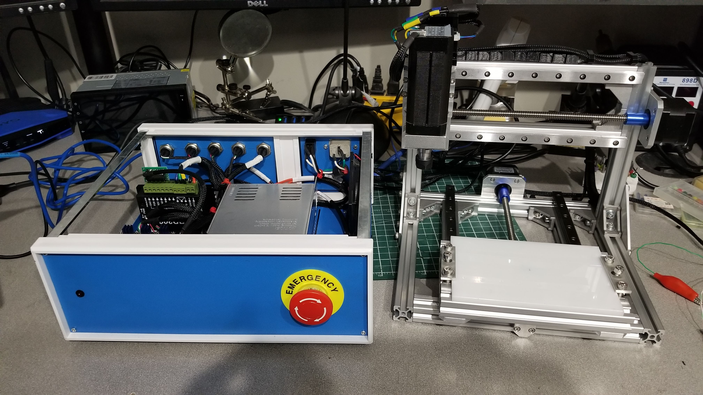

## TinyMill

TinyMill is a heavily upgraded version of a cheap [CNC-1610](https://www.aliexpress.com/item/4000574243750.html?src=google&albch=shopping&acnt=494-037-6276&isdl=y&slnk=&plac=&mtctp=&albbt=Google_7_shopping&aff_platform=google&aff_short_key=UneMJZVf&&albagn=888888&albcp=9604672960&albag=100679328364&trgt=296904913880&crea=en4000574243750&netw=u&device=c&albpg=296904913880&albpd=en4000574243750&gclid=CjwKCAiA4o79BRBvEiwAjteoYH8khWuuBjck_WOZqokQUPF9WctknqfjkEupP_b9n7I7WhbXmnuc8xoCqa8QAvD_BwE&gclsrc=aw.ds)

I was unhappy with the original spindle of the CNC-1610 after destroying a few of them.  I also found the backlash and 
deflection of the shaft style axis to be not so great.  My goal is to be able to mill PCBs with consistency, and also 
tackle plastic and soft metals at low chip loads.  The CNC-1610 by itself gets close to that goal, but lacked rigidity, 
and had too much run out on the spindle.

As part of the upgrades I wanted to use Trinamic drivers, which lead me to buying a BigTreeTech SKR 1.4 Turbo.  After
originally doing some trials with Marlin (2.0.0-bugfix), I was unsatisfied with the G-code support, bad spindle support,
non-realtime interaction, and the only supported front end for milling (CNC.js) lacked important features.
With the stock CNC-1610 I was using grbl 1.1 on the supplied atmega328p board, so it seemed natural to try Smoothieware next. 

Upgrades include:
- Linear rails
- Brushless Spindle + Controller (10,000RPM)
- Bigtreetech SKR 1.4 Turbo with TMC2209 drivers (only XYZ used)
- Heavy duty 24V PSU
- Big e-stop button (very important)
- Replaced all plastic parts with machined aluminum parts 
- Using Stallguard for homing axis

List of amazon (canada) parts used to upgrade to TinyMill
- Power Wire - https://www.amazon.ca/gp/product/B01MCRY7OT/ref=ppx_yo_dt_b_asin_title_o01_s00?ie=UTF8&psc=1
- BigtreeTech Controller with TCM2209 Drivers - https://www.amazon.ca/gp/product/B082QYYFVX/ref=ppx_yo_dt_b_asin_title_o02_s00?ie=UTF8&psc=1
- Electronics Case - https://www.amazon.ca/gp/product/B07NPHP9HD/ref=ppx_yo_dt_b_asin_title_o03_s00?ie=UTF8&psc=1
- Socket Cap Screws - https://www.amazon.ca/gp/product/B0734NVR48/ref=ppx_yo_dt_b_asin_image_o05_s00?ie=UTF8&psc=1
- 24V PSU - https://www.amazon.ca/gp/product/B07TWW8Q73/ref=ppx_yo_dt_b_asin_title_o03_s00?ie=UTF8&psc=1
- Brushless Spindle + Controller - https://www.amazon.ca/dp/B08CZFYJ8P/?coliid=IE8RGBNX8B8ED&colid=5LZDUEFHR9O1&psc=1&ref_=lv_ov_lig_dp_it
- Panel mount USB - https://www.amazon.ca/gp/product/B00FSYBKPM/ref=ppx_yo_dt_b_asin_title_o08_s00?ie=UTF8&psc=1
- Wiring Braid - https://www.amazon.ca/gp/product/B074GM1PK1/ref=ppx_yo_dt_b_asin_title_o09_s01?ie=UTF8&psc=1
- Aviation Connectors - https://www.amazon.ca/gp/product/B08BL43DTJ/ref=ppx_yo_dt_b_asin_title_o00_s00?ie=UTF8&psc=1
- 12mm linear Rails (X+Y) - https://www.amazon.ca/gp/product/B078M1M5KJ/ref=ppx_yo_dt_b_asin_title_o06_s00?ie=UTF8&psc=1
- 9mm linear rails (Z) - https://www.amazon.ca/gp/product/B07L636T2L/ref=ppx_yo_dt_b_asin_title_o02_s00?ie=UTF8&psc=1
- Estop button - https://www.amazon.ca/RuoFeng-Mushroom-Emergency-Button-Switch/dp/B07HBN45Q9/ref=sr_1_4?dchild=1&keywords=e+stop&s=industrial&sr=1-4

For the custom made parts, I can provide CAD models if there is interest, but I used my metal cutting CNC machine to make
the parts, so that may be out of the reach of most people. 